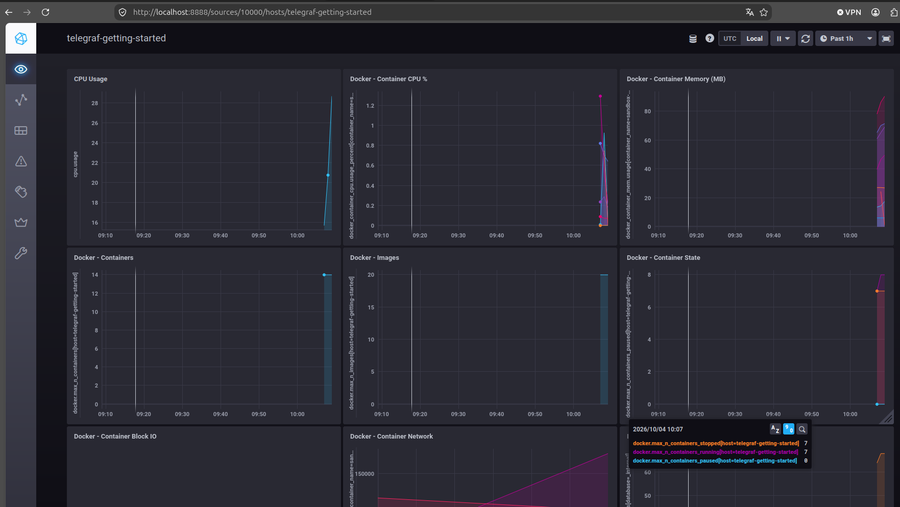
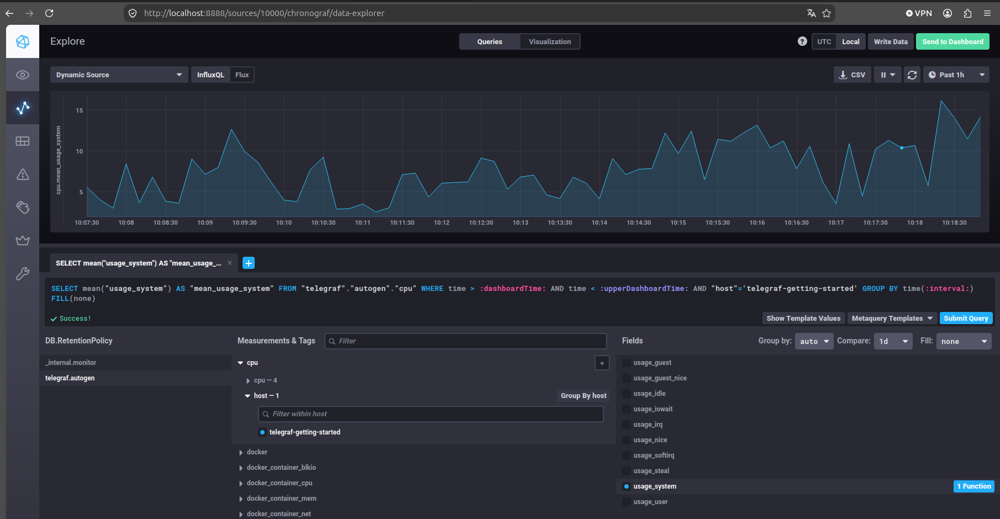
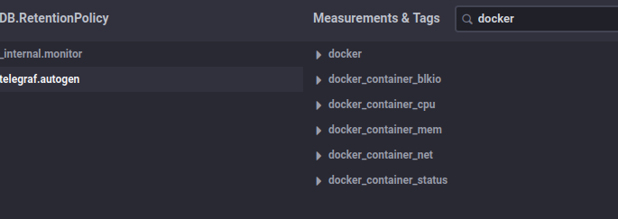
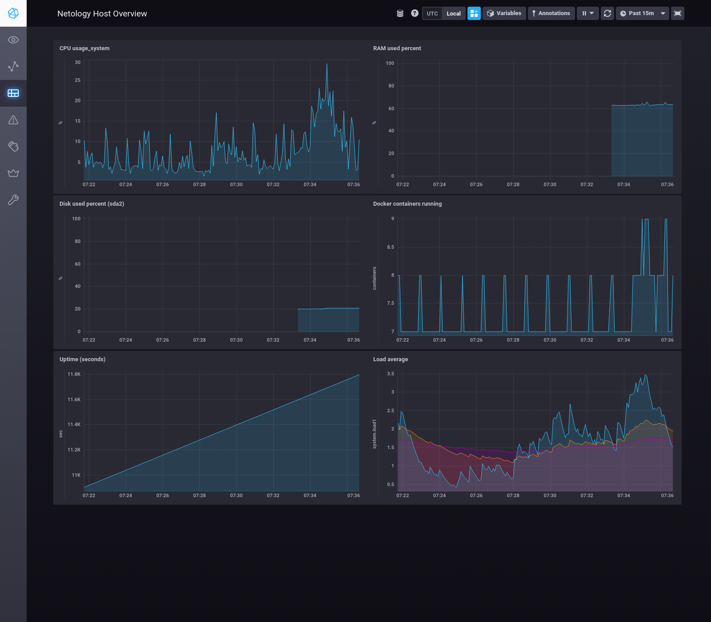

# Домашнее задание к занятию «13. Системы мониторинга». Гривняшкин Р. В.

---

## Обязательные задания

### 1. Минимальный набор метрик для платформы вычислений

**Условие:** платформа для вычислений с выдачей текстовых отчётов на диск; взаимодействие по HTTP; вычисления нагружают CPU. Какой минимальный набор метрик вывести в мониторинг и почему?

**Ответ:**

| Метрика | Зачем |
|---------|--------|
| RPS / число запросов | нагрузка на платформу |
| Ошибки 4xx/5xx (доля или rate) | доступность и корректность API |
| Latency (p50/p95 или avg) | качество для клиента |
| Длина очереди / wait (если есть) | насыщение, перегруз |
| CPU utilization | узкое место по условию |
| Disk free / used | отчёты на диск — риск отказа записи |

---

### 2. Метрики для менеджера продукта (качество обслуживания)

**Условие:** менеджеру непонятны RAM/inodes/CPUla; он хочет понимать выполнение обязательств перед клиентами и качество обслуживания. Что предложить?

**Ответ:**

RAM — сколько оперативной памяти занято.
Inodes — сколько файловых записей на диске использовано; при исчерпании нельзя создавать новые файлы (в т.ч. отчёты).
CPU load average — средняя длина очереди процессов к процессору; показывает, успевает ли система обрабатывать нагрузку.

Для качества обслуживания предложить модель SLI / SLO / SLA:
мониторим измеримые SLI (доступность HTTP, latency, доля ошибок, успех формирования отчёта), задаём внутренние SLO и сверяем с внешним SLA перед клиентами.
SLA/SLO сами по себе не собираются агентом — это цели; факт берётся из метрик приложения и HTTP.

---

### 3. Ошибки приложений без системы сбора логов

**Условие:** нет бюджета на систему сбора логов; разработчики хотят видеть все ошибки приложений. Какое решение предложить?

**Ответ:**

Бюджета на систему сбора логов нет, поэтому подключить error tracking (Sentry или аналог): в приложении SDK/перехватчик исключений отправляет ошибки (сообщение, stack trace, окружение) разработчикам. Это не full log pipeline, зато закрывает потребность «видеть все ошибки приложения» дёшево и быстро.

---

### 4. Ошибка в формуле SLA=99%

**Условие:** SLA считается как `summ_2xx_requests / summ_all_requests`, значение не выше 70%, при этом нет кодов 5xx и 4xx. Где ошибка?

**Ответ:**

(summ_2xx_requests + summ_3xx_requests)/summ_all_requests
или
summ_2xx_requests/(summ_all_requests - summ_3xx_requests)

---

### 5. Плюсы и минусы pull и push

**Ответ:**

#### Pull

| Плюсы | Минусы |
|-------|--------|
| Централизованный контроль scrape (что, как часто, labels) | Нужна доступность таргетов со стороны мониторинга (firewall/NAT) |
| Failed scrape сразу показывает, что цель недоступна | Эфемерные jobs можно не успеть заскрейпить |
| Приложению достаточно отдавать `/metrics` по запросу | При большом числе таргетов растут нагрузка и сложность конфига |
| Удобно с service discovery в динамических средах | |

#### Push

| Плюсы | Минусы |
|-------|--------|
| Работает за NAT/firewall (достаточно исходящего доступа) | Сложнее отличить «источник умер» от «просто нет данных» (нужен heartbeat/TTL) |
| Удобно для короткоживущих задач | Риск флуда и неконтролируемой частоты отправки |
| Не нужно открывать порт на каждом хосте для scrape | Схема меток сильнее зависит от агентов, централизованно управлять сложнее |
---

### 6. Модели: push / pull / гибрид

Гибрид здесь понимаю как схему, где в доставке метрик участвуют оба механизма (например Prometheus ← scrape ← Pushgateway ← push от job).
Zabbix / VictoriaMetrics отношу к системам, которые поддерживают и push, и pull (в т.ч. одновременно для разных источников); это не всегда один общий push→pull конвейер.

| Система | Модель | Комментарий |
|---------|--------|-------------|
| Prometheus | pull / гибрид | По умолчанию scrape (pull). Гибрид — через Pushgateway: job пушит метрики, Prometheus забирает их scrape |
| TICK | push | Telegraf собирает метрики и отправляет в InfluxDB |
| Zabbix | pull и push | Passive checks — server забирает (pull); active agent / trapper — агент отправляет (push). Это скорее два режима, не единый push→pull конвейер |
| VictoriaMetrics | pull и push / гибрид | Scrape (pull) и remote write (push) как режимы приёма. Ближе к гибриду — vmagent: scrape таргетов и remote_write в VM |
| Nagios | преимущественно pull | Сервер сам запускает проверки; пассивные checks (NSCA) — отдельный push-режим |

---

### 7. Запуск TICK-стека

**Условие:** склонировать [influxdata/sandbox](https://github.com/influxdata/sandbox/tree/master), запустить TICK через docker/docker-compose. Приложить скриншот Chronograf (`http://localhost:8888`).

**Скриншот:**



---

### 8. Data Explorer — утилизация CPU

**Условие:** в Chronograf → Data Explorer → БД `telegraf.autogen` → `cpu` → `usage_system` для хоста `telegraf-getting-started`. Приложить скриншот графика.

**Скриншот:**



**Запрос (InfluxQL), с которым экспериментировали:**

```sql
SELECT mean("usage_system") AS "mean_usage_system" FROM "telegraf"."autogen"."cpu" WHERE time > :dashboardTime: AND time < :upperDashboardTime: AND "host"='telegraf-getting-started' GROUP BY time(:interval:) FILL(none)
```

---

### 9. Telegraf input: docker

**Условие:** добавить плагин `docker` в конфиг telegraf, перезапустить, показать список `measurements` в `telegraf.autogen` (должны появиться docker-метрики).

**Что сделано:** в `influxdata/sandbox` плагин `docker` уже был в `telegraf/telegraf.conf`. При запуске на актуальном Telegraf 1.40 агент падал из‑за устаревших опций и отсутствия доступа к Docker API — конфиг и `docker-compose.yml` поправил, telegraf перезапустил.

**Изменения в `telegraf.conf`:**

```toml
[[inputs.docker]]
  endpoint = "unix:///var/run/docker.sock"
  timeout = "5s"
```

Удалены неподдерживаемые в Telegraf 1.40 поля: `container_names`, `perdevice`, `total`.

**Изменения в `docker-compose.yml` (сервис telegraf):**

```yaml
  telegraf:
    image: telegraf
    privileged: true
    user: "0:0"
    # GID группы docker на хосте: getent group docker | cut -d: -f3
    group_add:
      - "${DOCKER_GID:-982}"
    environment:
      HOSTNAME: "telegraf-getting-started"
    volumes:
      - ./telegraf/:/etc/telegraf/
      - /var/run/docker.sock:/var/run/docker.sock
    depends_on:
      - influxdb
```

Дополнительно: для Chronograf/Kapacitor исправлены права на каталоги `*/data` (ошибка `permission denied` при записи БД).

**Скриншот measurements:**



**Факультативно — какие docker-метрики появились:**

Ожидаемые measurements (после успешного сбора): `docker`, `docker_container_cpu`, `docker_container_mem`, `docker_container_net`, `docker_container_blkio` и связанные.

---

## Дополнительные задания (*)

### *1. Python-скрипт сбора метрик из `/proc` + cron

**Требования:**

- python3-скрипт
- метрики из `/proc` (можно расширить)
- лог: `/var/log/YY-MM-DD-awesome-monitoring.log`
- каждая запись — JSON-строка (`timestamp` + ≥4 метрики)
- запуск каждую минуту через cron
- ≥5 записей в примере лога

**а) Код скрипта:** [`optional/awesome-monitoring.py`](./optional/awesome-monitoring.py)

Скрипт читает `/proc/loadavg`, `/proc/meminfo`, `/proc/stat`, `/proc/uptime` и дописывает JSON-строку в дневной лог. Каталог лога задаётся `AWESOME_MONITORING_LOG_DIR` (по умолчанию `/var/log`).

```python
#!/usr/bin/env python3
"""Collect basic host metrics from /proc and append a JSON line to a daily log."""

from __future__ import annotations

import json
import os
import time
from pathlib import Path


LOG_DIR = Path(os.environ.get("AWESOME_MONITORING_LOG_DIR", "/var/log"))


def read_loadavg() -> dict[str, float]:
    parts = Path("/proc/loadavg").read_text().split()
    return {
        "loadavg_1": float(parts[0]),
        "loadavg_5": float(parts[1]),
        "loadavg_15": float(parts[2]),
    }


def read_meminfo() -> dict[str, int]:
    values: dict[str, int] = {}
    for line in Path("/proc/meminfo").read_text().splitlines():
        key, raw = line.split(":", 1)
        values[key] = int(raw.strip().split()[0])

    mem_total = values["MemTotal"]
    mem_available = values["MemAvailable"]
    mem_used = mem_total - mem_available
    swap_total = values["SwapTotal"]
    swap_free = values["SwapFree"]
    return {
        "mem_total_kb": mem_total,
        "mem_available_kb": mem_available,
        "mem_used_kb": mem_used,
        "mem_used_percent": round(mem_used * 100 / mem_total, 2) if mem_total else 0.0,
        "swap_used_kb": swap_total - swap_free,
    }


def read_cpu_times() -> dict[str, int]:
    fields = Path("/proc/stat").read_text().splitlines()[0].split()[1:]
    numbers = [int(x) for x in fields]
    idle = numbers[3] + (numbers[4] if len(numbers) > 4 else 0)
    total = sum(numbers)
    return {"cpu_idle_jiffies": idle, "cpu_total_jiffies": total}


def read_uptime() -> dict[str, float]:
    uptime_sec, idle_sec = Path("/proc/uptime").read_text().split()
    return {
        "uptime_seconds": float(uptime_sec),
        "idle_seconds": float(idle_sec),
    }


def collect_metrics() -> dict:
    metrics: dict = {"timestamp": int(time.time())}
    metrics.update(read_loadavg())
    metrics.update(read_meminfo())
    metrics.update(read_cpu_times())
    metrics.update(read_uptime())
    return metrics


def log_path_for_today() -> Path:
    return LOG_DIR / f"{time.strftime('%y-%m-%d')}-awesome-monitoring.log"


def main() -> None:
    LOG_DIR.mkdir(parents=True, exist_ok=True)
    path = log_path_for_today()
    with path.open("a", encoding="utf-8") as fh:
        fh.write(json.dumps(collect_metrics(), ensure_ascii=False) + "\n")


if __name__ == "__main__":
    main()
```

**б) Cron:** [`optional/awesome-monitoring.cron`](./optional/awesome-monitoring.cron)

```cron
* * * * * root AWESOME_MONITORING_LOG_DIR=/var/log /usr/bin/python3 /home/drozd/devops/netology-monitoring/optional/awesome-monitoring.py
```

Установка: `sudo cp optional/awesome-monitoring.cron /etc/cron.d/awesome-monitoring && sudo chmod 644 /etc/cron.d/awesome-monitoring`.

**в) Пример лога:** [`optional/26-10-04-awesome-monitoring.log`](./optional/26-10-04-awesome-monitoring.log) (5 записей; для примера в репозитории лог собран с `AWESOME_MONITORING_LOG_DIR=./optional`)

```json
{"timestamp": 1791099166, "loadavg_1": 1.71, "loadavg_5": 1.62, "loadavg_15": 1.54, "mem_total_kb": 8127760, "mem_available_kb": 2935996, "mem_used_kb": 5191764, "mem_used_percent": 63.88, "swap_used_kb": 0, "cpu_idle_jiffies": 2889955, "cpu_total_jiffies": 3372006, "uptime_seconds": 11564.76, "idle_seconds": 28835.15}
{"timestamp": 1791099167, "loadavg_1": 1.71, "loadavg_5": 1.62, "loadavg_15": 1.54, "mem_total_kb": 8127760, "mem_available_kb": 2936228, "mem_used_kb": 5191532, "mem_used_percent": 63.87, "swap_used_kb": 0, "cpu_idle_jiffies": 2890176, "cpu_total_jiffies": 3372307, "uptime_seconds": 11565.82, "idle_seconds": 28837.36}
{"timestamp": 1791099168, "loadavg_1": 1.71, "loadavg_5": 1.62, "loadavg_15": 1.54, "mem_total_kb": 8127760, "mem_available_kb": 2932540, "mem_used_kb": 5195220, "mem_used_percent": 63.92, "swap_used_kb": 0, "cpu_idle_jiffies": 2890431, "cpu_total_jiffies": 3372605, "uptime_seconds": 11566.86, "idle_seconds": 28839.92}
{"timestamp": 1791099169, "loadavg_1": 1.73, "loadavg_5": 1.63, "loadavg_15": 1.54, "mem_total_kb": 8127760, "mem_available_kb": 2932252, "mem_used_kb": 5195508, "mem_used_percent": 63.92, "swap_used_kb": 0, "cpu_idle_jiffies": 2890691, "cpu_total_jiffies": 3372913, "uptime_seconds": 11567.9, "idle_seconds": 28842.51}
{"timestamp": 1791099170, "loadavg_1": 1.73, "loadavg_5": 1.63, "loadavg_15": 1.54, "mem_total_kb": 8127760, "mem_available_kb": 2932268, "mem_used_kb": 5195492, "mem_used_percent": 63.92, "swap_used_kb": 0, "cpu_idle_jiffies": 2890940, "cpu_total_jiffies": 3373210, "uptime_seconds": 11568.94, "idle_seconds": 28845.0}
```

---

### *2. Dashboard в Chronograf

Создан дашборд **Netology Host Overview** (`http://localhost:8888/sources/10000/dashboards/2`).  
JSON-экспорт: [`optional/netology-host-overview-dashboard.json`](./optional/netology-host-overview-dashboard.json).

Для панелей RAM/дисков в telegraf добавлены inputs `mem` и `disk`.

**Панели:**

| Панель | Measurement / поле |
|--------|--------------------|
| CPU usage_system | `cpu.usage_system` (`cpu-total`) |
| RAM used percent | `mem.used_percent` |
| Disk used percent | `disk.used_percent` (`device=sda2`) |
| Docker containers running | `docker.n_containers_running` |
| Uptime (seconds) | `system.uptime` |
| Load average | `system.load1/5/15` |

**Скриншот dashboard:**



---

## Структура артефактов

```text
.
├── 10-monitoring-02-systems.md
├── screenshots/
│   ├── Chronograf.png
│   ├── CPU_dashboard.png
│   ├── docker_plugin.png
│   └── optional-dashboard.png
└── optional/
    ├── awesome-monitoring.py
    ├── awesome-monitoring.cron
    ├── 26-10-04-awesome-monitoring.log
    └── netology-host-overview-dashboard.json
```
